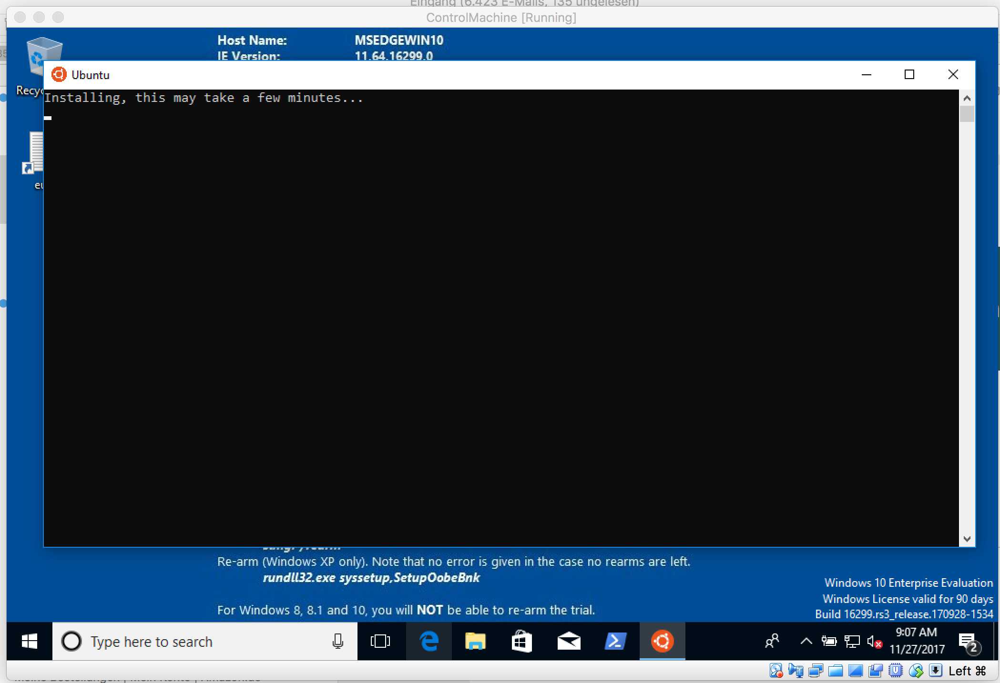
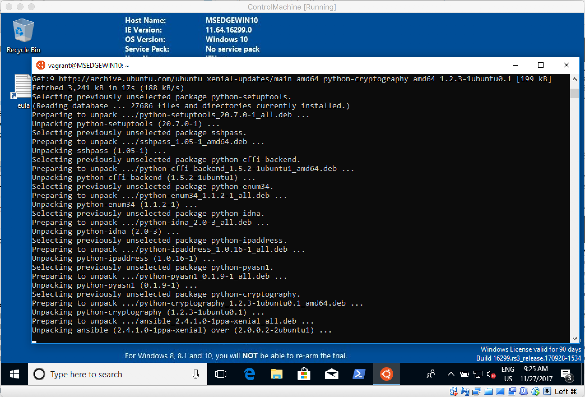

# Step 1: Prerequisites

First we need some tools like VirtualBox, Vagrant, git, Ansible...

## Mac

We´re using [homebrew](https://brew.sh/index_de) package manager here:

```text
$ brew cask install virtualbox
$ brew cask install vagrant
$ vagrant plugin install vagrant-dns
$ brew install git
$ brew install ansible

# Check all tools are working:
$ vagrant --version
$ git --version
$ ansible --version

# Install Vagrant plugins:
$ vagrant plugin install vagrant-dns
```

## Windows

### chocolatey & WSL

Bit more complicated then Mac/Unix, since Ansible doesn´t support Windows as the control machine. But there´s the [Windows Linux Subsystem \(WLS\)](https://docs.microsoft.com/en-us/windows/wsl/install-win10) ftw!

First we install VirtualBox, Vagrant & git with the package manager [chocolatey](https://chocolatey.org/). Open an evelated Powershell:

```text
$ Set-ExecutionPolicy Bypass -Scope Process -Force; iex ((New-Object System.Net.WebClient).DownloadString('https://chocolatey.org/install.ps1'))
```

Now chocolatey is present, install

```text
$ choco install virtualbox
$ choco install vagrant
$ choco install git

# Check all tools are working:
$ vagrant --version
$ git --version

# Install Vagrant plugins:
$ vagrant plugin install vagrant-dns
```


Now we need to configure WLS:

```text
Enable-WindowsOptionalFeature -Online -FeatureName Microsoft-Windows-Subsystem-Linux
```

Now search the Windows Store for Ubuntu. Install it with **GET**. Press **LAUNCH** then:



Now choose username and password.

Then update packages via

```text
sudo apt-get update
```

### Configure Ansible Control Machine on WSL

See [http://docs.ansible.com/ansible/latest/intro\_installation.html\#latest-releases-via-apt-ubuntu](http://docs.ansible.com/ansible/latest/intro_installation.html#latest-releases-via-apt-ubuntu)

```text
sudo apt-add-repository ppa:ansible/ansible
sudo apt-get update
sudo apt-get install ansible

# Check all tools are working:
$ ansible --version
```




Don´t get confused: On Windows the tools Vagrant & VirtualBox must be used from a PowerShell, Ansible will be used from the Windows Linux Subsystem \(WSL\).


