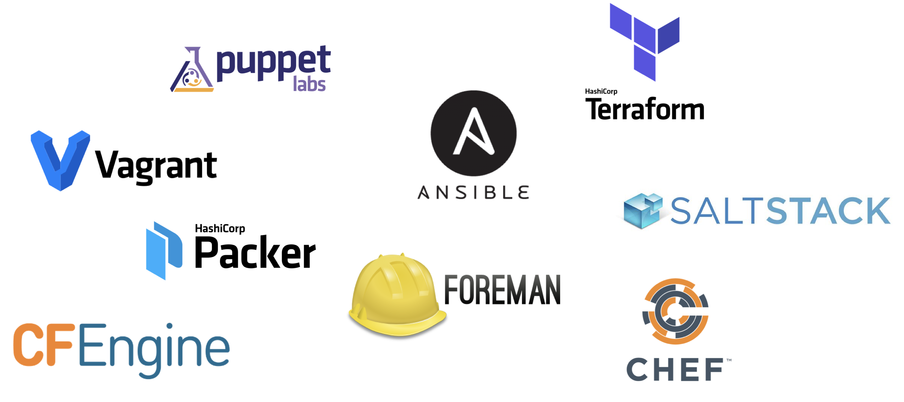

# Step 3: GitLab CI installation overview

To achieve a fully features GitLab installation we need to roughly do 5 things:

* **Install Docker \(1.\)** on our machine and
* **Fetch proper Let´s Encrypt certificates \(2.\)** for our not publicly accessible Vagrant Box.
* Then everything needed for the **GitLab Omnibus installation \(3.\)** is done in the next task, followed by the
* **Configuration of the GitLab Container Registry \(4.\)**. The fifth step finally is to
* **Register a set of GitLab Runners \(5.\)** that will be able to interact with the server´s Docker engine.

## Infrastructure-as-Code with Ansible

Remember we wanted to do everything in an Infrastructure-as-Code manner? So nothing should be done without code, right?! So let´s pick one of the many available tools out there:



As Ansible is one of the cool kids in town - and brings in massive advantages compared to the others - we´ll pick this one for the workshop. One of the cool things about Ansible is it´s flat learning curve, which is also reflected in the usage of simple [YAML](https://en.wikipedia.org/wiki/YAML) files - [called playbooks](https://docs.ansible.com/ansible/latest/user_guide/playbooks.html).

## Our first Ansible playbook

Now let´s create our first playbook called `prepare-gitlab.yml`:

```yaml
- hosts: all
  become: true

  tasks:
  - name: Update apt
    apt:
      update_cache: yes
    tags: update
```

As we want to provision our Vagrant Box \(or potentially lot´s of servers\) with our playbook, we need to configure the specific host. Therefore Ansible uses [the concept of inventories](https://docs.ansible.com/ansible/latest/user_guide/intro_inventory.html). For now simply create a file calles `hosts`:

```text
[gitlab-ci-stack]
172.16.2.15
```

You may recognize that this is our configure IP inside of our Vagrantfile - and to be consistent, we also name the Ansible host group `gitlab-ci-stack`.

Although Ansible also allows us to configure variables inside inventories, this is no best practice. So let´s start with defining our variables in a better way. Simply create a directory `group_vars` and a new file `gitlab-ci-stack.yml` inside of it:

```yaml
ansible_user: vagrant
ansible_ssh_private_key_file: .vagrant/machines/gitlab-ci-stack/virtualbox/private_key
ansible_python_interpreter: /usr/bin/python3
```

The first parameter `ansible_user` tell Ansible to user our Vagrant user. The second `ansible_ssh_private_key_file` is needed since Vagrant automatically creates and inserts a new keypair after the first `vagrant up`. To give Ansible the chance to use this key, we need to configure it here. The last parameter `ansible_python_interpreter` tells Ansible to use the pre-installed Python 3 interpreter. The default version 2 isn´t present on Ubuntu boxes &gt; 14.04. anymore.

## Run the playbook

Now everything should be prepared to run our first playbook! Running playbooks is easy - just type `ansible-playbook -i hosts prepare-gitlab.yml` and it should run an `apt-get update` inside our Vagrant Box:

```text
$ ansible-playbook -i hosts prepare-gitlab.yml 

PLAY [all] **************************************************************************************************

TASK [Gathering Facts] **************************************************************************************
ok: [172.16.2.15]

TASK [Update apt] *******************************************************************************************
changed: [172.16.2.15]

PLAY RECAP **************************************************************************************************
172.16.2.15                : ok=2    changed=1    unreachable=0    failed=0
```

